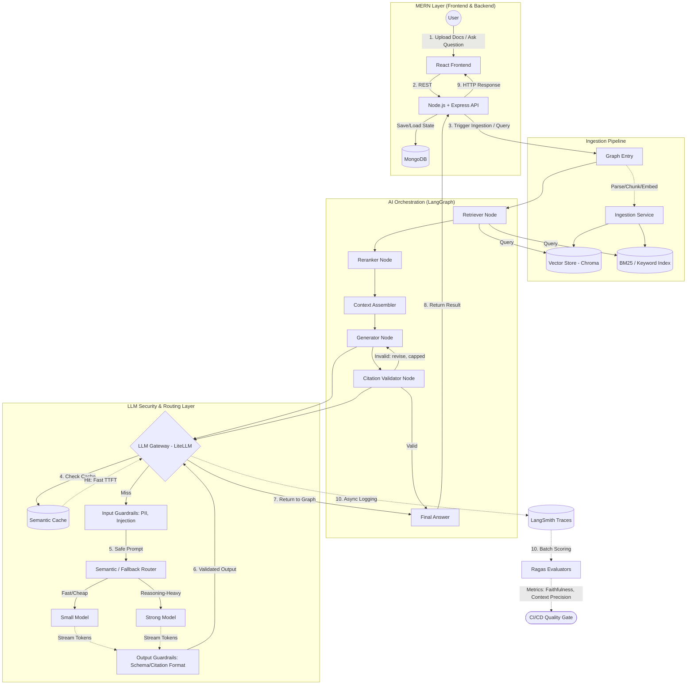

# Ask My Docs — Production RAG Application

A production-grade Retrieval-Augmented Generation (RAG) pipeline featuring **hybrid search**, **strict citation enforcement**, and a **self-correcting validation loop**. Built as a full-stack "chat with your documents" system rather than a single-prompt wrapper around an LLM.

This repository is a completed reference implementation — a working demonstration of how to design a RAG pipeline that is structurally biased toward catching its own errors, instead of hoping a single generation gets everything right the first time.

---

## 1. Problem Statement

Standard single-prompt LLM usage breaks down quickly when used as a "chat with your documents" tool, for three structural reasons:

- **Hallucination when the model runs out of real evidence.** A single LLM call, when it doesn't actually know the answer from the supplied text, will often generate a fluent, confident-sounding answer anyway — filling the gap from its own parametric memory rather than admitting the document set doesn't cover the question.
- **Recall failure from single-strategy retrieval.** Pure vector (semantic) search misses exact-match queries (error codes, product names, config keys) where lexical overlap matters more than semantic similarity. Pure keyword search misses paraphrased questions.
- **No self-check before the answer ships.** A single forward pass has no mechanism to verify its own output against the retrieved evidence once generation is done. The citation itself can be a hallucination.

Ask My Docs addresses all three with a **hybrid-retrieval, citation-enforced, self-correcting pipeline**.

---

## 2. Special Features

What sets this pipeline apart from a typical "embed and prompt" RAG demo:

- **Hybrid retrieval, not just vector search.** Every query hits both a Chroma vector store (semantic similarity) and a BM25 keyword index (exact/lexical match) in parallel, so paraphrased questions and exact-match lookups (error codes, product names, config keys) are both handled well.
- **Reranking before generation.** Results from the two retrieval strategies are merged and reranked by a dedicated node before the context is assembled — the model only ever sees the most relevant evidence, not a raw concatenation of two search results.
- **Citations are enforced, not requested.** The Generator is required to cite the chunks it draws from, and a separate **Citation Validator node** checks each citation against the actual retrieved evidence after generation — catching the common failure mode where the citation itself is fabricated.
- **Self-correcting validation loop.** If validation fails, the graph loops back to the Generator for a capped number of retries instead of silently shipping an unverified answer. This closes the loop that a single forward pass through an LLM can't close on its own.
- **Full LLM gateway, not a bare API call.** Every model call passes through a LiteLLM gateway with:
  - a **semantic cache** for fast repeat answers,
  - **input guardrails** for PII and prompt-injection detection,
  - a **fast/strong model router** that sends cheap queries to a small model and reasoning-heavy queries to a stronger one,
  - **output guardrails** that enforce response schema and citation format before anything reaches the user.
- **Built-in observability and evaluation.** Every gateway call is traced to LangSmith, and Ragas evaluators batch-score those traces for **faithfulness** and **context precision**, feeding a CI/CD quality gate — so pipeline quality is measurable, not just assumed.
- **Genuinely full-stack.** A React chat UI and a Node/Express + MongoDB backend sit in front of an independently served FastAPI/LangGraph AI service — the architecture of a real application, not a notebook.

---

## 3. Architecture

The system is split into three cooperating layers:

- **MERN layer** (React + Node/Express + MongoDB) — handles document upload, chat UI, and persisted state.
- **AI orchestration layer** (LangGraph, served via FastAPI) — runs ingestion and the retrieve → rerank → generate → validate loop.
- **LLM security & routing layer** (LiteLLM gateway) — caches, guards, and routes every model call, and streams traces to evaluation tooling.



### Request flow

1. The user uploads documents or asks a question through the **React** frontend.
2. **Node.js/Express** persists state to **MongoDB** and forwards the request to the **FastAPI**-hosted LangGraph service.
3. During ingestion, documents are parsed, chunked, and embedded into both a **Chroma vector store** (semantic) and a **BM25 index** (lexical).
4. At query time, the **Retriever node** queries both indexes; the **Reranker** merges and reorders results before the **Context Assembler** builds the prompt.
5. The **Generator node** produces a cited answer, and the **Citation Validator node** checks every citation against the retrieved evidence — looping back to regenerate (up to a cap) if validation fails.
6. All model calls pass through the **LiteLLM gateway**: semantic cache, input guardrails, model router, and output guardrails.
7. The final answer is returned via the REST API response to the client.
8. Every gateway call is asynchronously logged to **LangSmith**; **Ragas** evaluators batch-score traces for faithfulness and context precision, feeding a **CI/CD quality gate**.

---

## 4. Tech Stack

| Layer | Technology |
|---|---|
| Frontend | React |
| App backend | Node.js, Express, MongoDB |
| AI service | FastAPI, LangGraph |
| Retrieval | Chroma (vector store), BM25 (keyword index) |
| LLM routing & safety | LiteLLM gateway, semantic cache, input/output guardrails |
| Observability & eval | LangSmith, Ragas, CI/CD quality gate |

---

## 5. Project Structure

The repository has two independently-run services: a Node/Express API gateway (`backend/`) and a Python/FastAPI + LangGraph AI service (`ai-research/`). There is no bundled frontend in this repository — the API is designed to be called directly (e.g. via Postman/Thunder Client) or from a separate client.

```
Ask-My-Docs/
├── backend/                          # Node.js/Express API gateway (auth, docs, MongoDB, proxies to ai-research)
│   ├── server.js                     # Entry point — Express app and MongoDB connection
│   ├── .env.sample                   # PORT, MONGODB_URI, JWT_SECRET, FASTAPI_URL, CORS_ORIGIN
│   └── src/
│       ├── routes/
│       │   ├── auth.routes.js        # /auth  — register, login, logout
│       │   ├── documents.routes.js   # /documents — upload, status polling
│       │   └── query.routes.js       # /query — ask a question
│       ├── controllers/              # Request handlers backing each route
│       │   ├── auth.controller.js
│       │   ├── document.controller.js
│       │   └── query.controller.js
│       ├── middleware/
│       │   └── auth.middleware.js    # Verifies the JWT stored in an httpOnly cookie
│       ├── models/                   # Mongoose schemas
│       │   ├── User.model.js
│       │   ├── Document.model.js
│       │   └── QueryRecord.model.js
│       └── lib/
│           └── aiClient.js           # HTTP client that calls the ai-research FastAPI service
│
├── ai-research/                      # Python/FastAPI + LangGraph RAG pipeline
│   ├── main.py                       # FastAPI entry point (uvicorn target: `main:app`)
│   ├── config.py                     # Settings — 1:1 with .env.sample, fail-fast on missing required vars
│   ├── events.py                     # Shared event/enum definitions used across nodes
│   ├── observability.py              # Logfire + LangSmith wiring
│   ├── .env.sample                   # LLM keys, Qdrant, Redis, guardrails, observability config
│   ├── graph/
│   │   ├── build_graph.py            # Wires all nodes into the LangGraph state machine
│   │   └── state.py                  # Shared graph state schema
│   ├── nodes/                        # One file per graph node
│   │   ├── triage.py                 # Input guardrail + intent routing (greeting/RAG/summary)
│   │   ├── retriever_node.py         # Wide vector retrieval (Qdrant)
│   │   ├── reranker_node.py          # Narrows results via FlashRank
│   │   ├── context_assembler.py      # Formats retrieved chunks into a prompt context
│   │   ├── context_check.py          # LLM check: is the context safe and query-relevant?
│   │   ├── generator_node.py         # Drafts the cited answer (strong model)
│   │   ├── evaluator.py              # Citation validation + output guardrail + answer critique
│   │   ├── summarise.py              # Document summary path
│   │   └── utils.py
│   ├── retrieval/
│   │   ├── vector_store.py           # Qdrant Cloud collection setup + payload indexes
│   │   ├── vector_retriever.py       # Retrieval query logic
│   │   └── reranker.py               # FlashRank singleton
│   ├── ingestion/
│   │   ├── parser.py                 # PDF parsing
│   │   ├── chunker.py                # Chunking (CHUNK_SIZE / CHUNK_OVERLAP)
│   │   ├── embedder.py               # Embedding generation
│   │   └── indexer.py                # Writes chunks + embeddings into Qdrant
│   ├── generation/
│   │   └── generator.py              # Prompting logic used by generator_node
│   ├── llm_gateway/
│   │   ├── router.py                 # LiteLLM-based router (cheap-model / evaluator-model / strong-model)
│   │   └── litellm_config.yaml       # Model routing configuration
│   ├── guardrails/                   # NeMo Guardrails (input safety, always on, no LLM call)
│   │   ├── config.yml
│   │   ├── guardrails_service.py
│   │   ├── output_guardrails.yaml
│   │   └── rails/input_rails.co
│   ├── requirements.txt
│   └── README.md                     # Full API contract + pipeline diagram for this service
│
└── .gitignore
```

---

## 6. Setup Guide

### Prerequisites

- Python 3.10+
- Node.js 18+
- MongoDB (local or hosted, e.g. MongoDB Atlas)
- Redis (optional — only async ingestion job-status tracking is skipped if unavailable)
- API keys: **Groq** (cheap/evaluator models) and **Gemini** (strong model), plus **Qdrant Cloud** credentials

### 1. Clone the repository

```bash
git clone https://github.com/Yashg34/Ask-My-Docs.git
cd Ask-My-Docs
```

### 2. Set up the AI service (`ai-research/`)

```bash
cd ai-research
cp .env.sample .env
# Fill in: GROQ_API_KEY, GEMINI_API_KEY, QDRANT_URL, QDRANT_API_KEY (all required)
# Optional: REDIS_URL, LOGFIRE_TOKEN, LANGSMITH_API_KEY

pip install -r requirements.txt
```

### 3. Set up the API gateway (`backend/`)

```bash
cd ../backend
cp .env.sample .env
# Fill in: MONGODB_URI, JWT_SECRET
# FASTAPI_URL defaults to http://127.0.0.1:8000 — update if ai-research runs elsewhere

npm install
```

---

## 7. Running the Pipeline

Run the two services in separate terminals.

**Terminal 1 — AI service (ai-research):**

```bash
cd ai-research
python main.py
```

This starts the FastAPI/LangGraph service (default `http://127.0.0.1:8000`), exposing `/query`, `/ingest`, `/ingest/status/{job_id}`, and `/health` directly.

**Terminal 2 — API gateway (backend):**

```bash
cd backend
npm run dev
```

This starts the Express server (default `http://localhost:5000`) with MongoDB connected, exposing `/auth`, `/documents`, `/query`, and `/health`.

### Testing with Postman / Thunder Client

There's no bundled frontend, so the intended way to exercise the pipeline is directly against the `backend` API:

1. **Register a user**
   `POST http://localhost:5000/auth/register` — JSON body: `{ "email": "...", "password": "..." }`

2. **Log in**
   `POST http://localhost:5000/auth/login` — same body. This sets an `httpOnly` JWT cookie (`token`); make sure your client is configured to store and send cookies on subsequent requests (Postman/Thunder Client: enable cookie jar / "send cookies automatically").

3. **Upload a document**
   `POST http://localhost:5000/documents/upload` — `multipart/form-data`, field name `file` (PDF, ≤ 20 MB). Requires the auth cookie from step 2.

4. **Poll ingestion status**
   `GET http://localhost:5000/documents/:id/status` — requires the auth cookie.

5. **Ask a question**
   `POST http://localhost:5000/query` — JSON body: `{ "query": "your question here" }`. Requires the auth cookie; the gateway proxies this to the `ai-research` service's `/query` endpoint and returns the generated, cited answer along with the retrieved chunks.

You can also call the `ai-research` service directly (bypassing auth/Mongo) for pipeline-only testing, e.g. `POST http://127.0.0.1:8000/query` with header `X-User-Id: test-user` — see `ai-research/README.md` for the full request/response schema.

### How to Read the Output

Every `/query` response has the same shape regardless of outcome (`answer`, `retrieved_chunks`, `latency_seconds`). `retrieved_chunks` is populated for a normal in-domain answer, and empty for greetings, off-topic questions, or guardrail-blocked input — so an empty array is a meaningful signal, not a bug. Each cited answer is checked against its retrieved chunks by the Evaluator node before being returned; if a citation doesn't hold up, the graph reroutes back to generation (or retrieval) rather than shipping an unverified claim.

---

## 7. Project Status

This project is **complete and not under active development**. It stands as a reference implementation of a hybrid-retrieval, citation-enforced, self-correcting RAG architecture. Issues and pull requests may not be actively monitored, but the code and architecture remain a useful blueprint for anyone building a similar pipeline.
