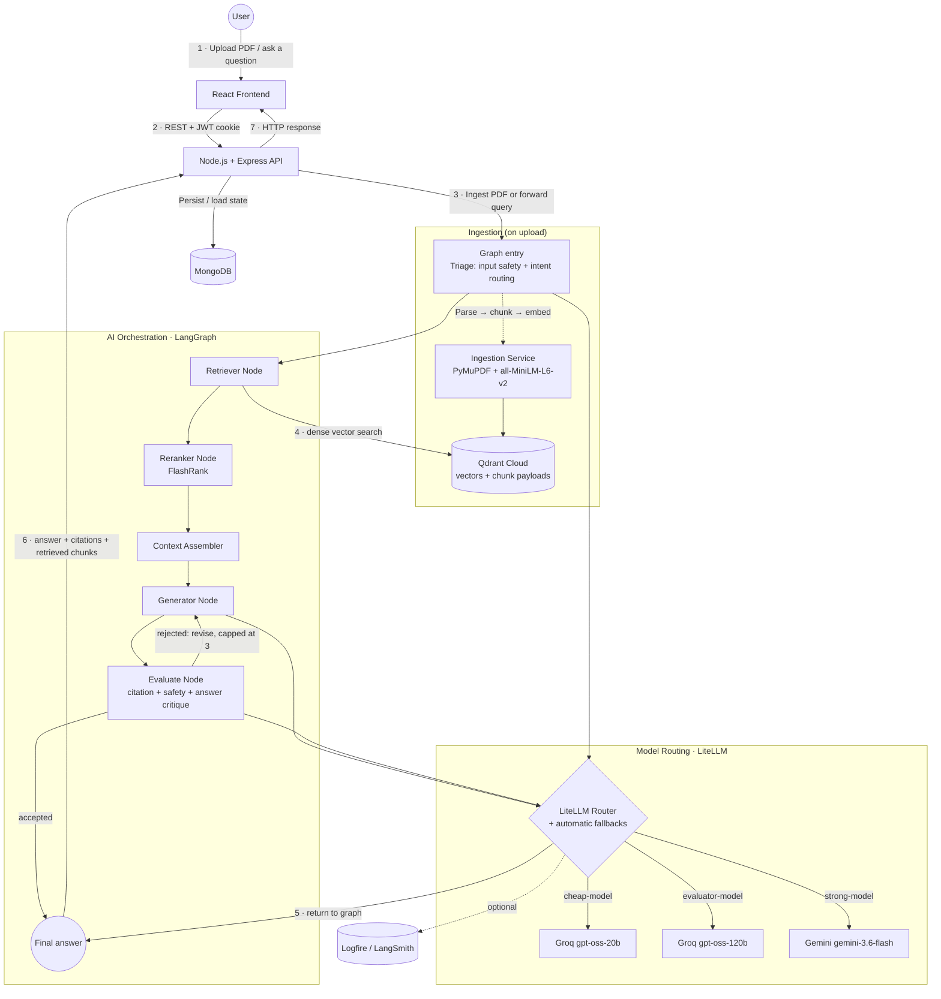
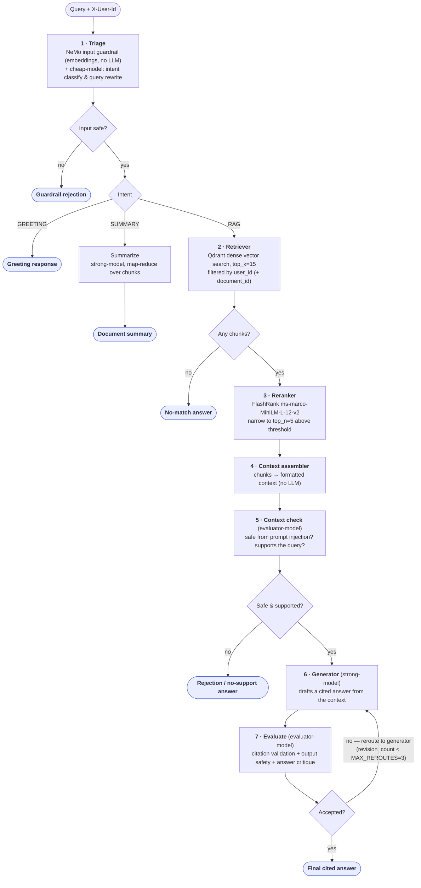

# Ask My Docs

**Chat with your own PDFs, with page-cited, guardrailed answers.**

`React` · `Node/Express` · `FastAPI + LangGraph` · `Qdrant` · `MongoDB` · `Groq` · `Gemini`

Ask My Docs is a full-stack document question-answering application. Users
register, upload PDFs, organize conversations into chat sessions, and ask
questions against all their documents or a single selected one. Every answer
is checked against retrieved context and cited by PDF name and page before it
reaches the user — the pipeline would rather say "I couldn't find that" than
answer without support.

The application has three services:

1. **React + Vite** frontend (`frontend/`)
2. **Node.js + Express** API, authentication, and persistence (`backend/`)
3. **FastAPI + LangGraph** document ingestion and agentic RAG service (`ai-research/`)

MongoDB stores application users, documents, sessions, and query history.
Qdrant Cloud stores document embeddings and chunk metadata. Redis is optional
and is used for asynchronous ingestion job status.

> Licensed under [MIT](./LICENSE).

## Contents

- [Features](#features)
- [Architecture](#architecture)
- [RAG pipeline](#rag-pipeline)
  - [Pipeline diagram](#pipeline-diagram)
  - [Model routing](#model-routing)
- [Technology](#technology)
- [Evaluation results](#evaluation-results)
- [Project layout](#project-layout)
- [Requirements and configuration](#requirements-and-configuration)
- [Install and run locally](#install-and-run-locally)
- [API overview](#api-overview)
- [Evaluation harness](#evaluation-harness)
- [Security and operations notes](#security-and-operations-notes)
- [License](#license)

## Features

- Account registration, login, and logout using an HTTP-only JWT cookie.
- PDF upload (maximum 20 MB), background ingestion, status polling, retry of
  failed uploads, and deletion.
- Document selection to scope questions, or ask across all of the user's
  documents.
- Persistent chat sessions, session titles, and saved query/answer history.
- Live query progress events via Server-Sent Events (SSE).
- RAG responses with citations referencing the PDF name and page number.
- A retrieval, context-safety, and answer-quality loop that avoids generating
  from missing, irrelevant, or unsafe context.
- Local text embeddings and reranking; hosted Groq and Gemini models for
  routing, evaluation, and generation.
- Optional Logfire instrumentation and LangSmith tracing.
- A golden-question evaluation harness with retrieval, citation, latency, and
  LLM-judge answer-quality metrics.

## Architecture

A bird's-eye view of the system. For the full node-by-node LangGraph flow —
including the input-safety gate, the post-retrieval context-safety check, and
the reroute loop — see the [pipeline diagram](#pipeline-diagram) further down.


```mermaid
graph TD
    User((User)) -->|"1 · Upload PDF / ask a question"| React[React Frontend]
    React -->|"2 · REST + JWT cookie"| Node[Node.js + Express API]
    Node -->|Persist / load state| Mongo[("MongoDB")]

    Node -->|"3 · Ingest PDF or forward query"| FastAPI

    subgraph ingestion["Ingestion (on upload)"]
        FastAPI -.->|"Parse → chunk → embed"| Ingest["Ingestion Service<br/>PyMuPDF + all-MiniLM-L6-v2"]
        Ingest --> Qdrant[("Qdrant Cloud<br/>vectors + chunk payloads")]
    end

    subgraph orchestration["AI Orchestration · LangGraph"]
        FastAPI["Graph entry<br/>Triage: input safety + intent routing"] --> Retriever[Retriever Node]
        Retriever -->|"4 · dense vector search"| Qdrant
        Retriever --> Reranker["Reranker Node<br/>FlashRank"]
        Reranker --> Assembler[Context Assembler]
        Assembler --> Generator[Generator Node]
        Generator --> Validator["Evaluate Node<br/>citation + safety + answer critique"]
        Validator -->|"rejected: revise, capped at 3"| Generator
        Validator -->|accepted| Done(("Final answer"))
    end

    FastAPI --> Gateway
    Generator --> Gateway
    Validator --> Gateway

    subgraph gateway_layer["Model Routing · LiteLLM"]
        Gateway{"LiteLLM Router<br/>+ automatic fallbacks"} -->|cheap-model| Cheap["Groq gpt-oss-20b"]
        Gateway -->|evaluator-model| EvalModel["Groq gpt-oss-120b"]
        Gateway -->|strong-model| Strong["Gemini gemini-3.6-flash"]
    end

    Gateway -->|"5 · return to graph"| Done
    Done -->|"6 · answer + citations + retrieved chunks"| Node
    Node -->|"7 · HTTP response"| React

    Gateway -.->|optional| Obs[("Logfire / LangSmith")]
```

### Request and data flow

1. The browser calls the Express API. Login establishes an HTTP-only JWT cookie;
   protected routes use that cookie to identify the user.
2. On upload, Express checks for a PDF (up to 20 MB), hashes it for duplicate
   detection, saves a MongoDB document record, and forwards the PDF to FastAPI
   in the background.
3. FastAPI extracts and normalizes PDF page text, splits it into overlapping
   structure-aware chunks, embeds the chunks with `all-MiniLM-L6-v2`, and
   upserts vectors plus ownership/page metadata to Qdrant.
4. The UI polls the document status. Redis backs job-status tracking when
   available; the AI service can fall back to in-memory tracking.
5. For a question, Express forwards the query and authenticated user ID to
   FastAPI. The RAG pipeline filters Qdrant results by `user_id`, and by
   `document_id` when a document is selected.
6. FastAPI returns the answer, latency, and retrieved chunks. Express persists
   the query and answer in MongoDB and returns the response to the browser.
7. In parallel with the query request, the UI can subscribe to the query's SSE
   progress endpoint. Express relays events from FastAPI.

## RAG pipeline

The current LangGraph flow is:

1. **Triage and input safety** — NeMo Guardrails checks every input first. A
   lightweight Groq model then classifies greeting, RAG, or summary intent and
   rewrites document questions into search terms. Out-of-domain classification
   is telemetry; retrieval and the context check decide whether there is
   support in the user's documents.
2. **Retrieval** — the local embedding model vectorizes the search query.
   Qdrant returns up to `TOP_K_RETRIEVAL` chunks, scoped to the user and
   optionally to one document. No chunks means the graph returns a
   no-information answer without generation.
3. **Reranking** — FlashRank scores the candidates and keeps up to
   `TOP_K_RERANK` passages above the request's score threshold.
4. **Context assembly and context check** — the selected passages are formatted
   and an evaluator model checks whether the context is both safe from
   prompt-injection instructions and relevant enough to support the question.
   Unsafe or unsupported context stops before answer generation.
5. **Generation and output evaluation** — Gemini drafts a cited response. The
   evaluator checks citation presence and that cited document pages occur in
   the retrieved context, then evaluates safety and whether the answer addresses
   the question. A failed answer is sent back to generation with feedback for
   up to three reroutes.
6. **Summary path** — summary requests use the graph's summary node rather than
   the normal retrieval-and-answer route. Greetings return a short response
   without retrieval.

NeMo input safety is embedding-based and does not add an LLM call. If a safety
check service fails, `GUARDRAIL_FAIL_MODE=closed` (the default) fails closed;
`open` allows the graph to proceed when the safety service is unavailable.
Genuine safety blocks are not overridden by `open`.

### Pipeline diagram

This follows the graph wiring in
[`ai-research/graph/build_graph.py`](./ai-research/graph/build_graph.py) node
for node, including its routing functions (`intent_router`,
`route_after_retrieval`, `context_router`, `evaluate_router`). Every node also
emits a Logfire span and an SSE progress event as it runs.


```mermaid
flowchart TD
    START(["Query + X-User-Id"]) --> TRIAGE

    TRIAGE["<b>1 · Triage</b><br/>NeMo input guardrail (embeddings, no LLM)<br/>+ cheap-model: intent classify &amp; query rewrite"]
    TRIAGE --> SAFE{"Input safe?"}
    SAFE -- "no" --> REJECT_IN(["Guardrail rejection"]):::terminal
    SAFE -- "yes" --> INTENT{"Intent"}

    INTENT -- "GREETING" --> GREET(["Greeting response"]):::terminal
    INTENT -- "SUMMARY" --> SUMMARIZE["Summarize<br/>strong-model, map-reduce over chunks"]
    INTENT -- "RAG" --> RETRIEVE

    SUMMARIZE --> SUM_DONE(["Document summary"]):::terminal

    RETRIEVE["<b>2 · Retriever</b><br/>Qdrant dense vector search, top_k=15<br/>filtered by user_id (+ document_id)"]
    RETRIEVE --> HAS_CHUNKS{"Any chunks?"}
    HAS_CHUNKS -- "no" --> NO_INFO(["No-match answer"]):::terminal
    HAS_CHUNKS -- "yes" --> RERANK

    RERANK["<b>3 · Reranker</b><br/>FlashRank ms-marco-MiniLM-L-12-v2<br/>narrow to top_n=5 above threshold"]
    RERANK --> ASSEMBLE["<b>4 · Context assembler</b><br/>chunks → formatted context (no LLM)"]
    ASSEMBLE --> CTXCHECK

    CTXCHECK["<b>5 · Context check</b> (evaluator-model)<br/>safe from prompt injection? supports the query?"]
    CTXCHECK --> CTX_OK{"Safe &amp; supported?"}
    CTX_OK -- "no" --> REJECT_CTX(["Rejection / no-support answer"]):::terminal
    CTX_OK -- "yes" --> GENERATE

    GENERATE["<b>6 · Generator</b> (strong-model)<br/>drafts a cited answer from the context"]
    GENERATE --> EVALUATE

    EVALUATE["<b>7 · Evaluate</b> (evaluator-model)<br/>citation validation + output safety + answer critique"]
    EVALUATE --> ACCEPT{"Accepted?"}
    ACCEPT -- "yes" --> FINAL(["Final cited answer"]):::terminal
    ACCEPT -- "no — reroute to generator<br/>(revision_count &lt; MAX_REROUTES=3)" --> GENERATE

    classDef terminal fill:#e9edff,stroke:#5067dc,color:#26314d,font-weight:bold;
```

Four LLM calls on the happy path: **Triage** (cheap-model) → **Context check**
(evaluator-model) → **Generator** (strong-model) → **Evaluate**
(evaluator-model). The NeMo input guardrail, retrieval, reranking, and context
assembly add no LLM calls. The context check exists specifically to gate the
expensive strong-model call behind a safety + relevance check; the evaluate
node's answer critique decides whether the draft actually addresses the
question and, if not, sends it back to the generator with feedback — capped at
`MAX_REROUTES` (3) so a stubborn answer can't loop forever.

### Model routing

LiteLLM uses the model aliases configured in
[`ai-research/llm_gateway/litellm_config.yaml`](./ai-research/llm_gateway/litellm_config.yaml):

| Alias | Main model | Main use |
|---|---|---|
| `cheap-model` | Groq `openai/gpt-oss-20b` | Intent routing and query rewrite |
| `evaluator-model` | Groq `openai/gpt-oss-120b` | Context check and output evaluation |
| `strong-model` | Gemini `gemini-3.6-flash` | Final answer generation |

Fallback aliases are configured for each role: Gemini Flash-Lite for routing,
Groq `gpt-oss-120b` for generation, and Gemini Flash for evaluation. Summary
generation uses the model aliases defined by the corresponding graph nodes.

## Technology

| Area | Components |
|---|---|
| Frontend | React 18, Vite, React Router, React Markdown, remark-math, KaTeX |
| Application/API | Node.js, Express 5, Axios, Multer, cookie-parser, CORS |
| Authentication | JSON Web Tokens in HTTP-only cookies; bcryptjs password hashing |
| Application persistence | MongoDB with Mongoose |
| AI API and orchestration | Python, FastAPI, Uvicorn, LangGraph, Pydantic Settings |
| PDF ingestion | PyMuPDF (`pymupdf`), LangChain text splitters |
| Embeddings | Sentence Transformers `all-MiniLM-L6-v2` |
| Vector store | Qdrant Cloud with cosine similarity and ownership payload filters |
| Reranking | FlashRank `ms-marco-MiniLM-L-12-v2` |
| Model access | LiteLLM Router, Groq, Gemini |
| Input/output safety | NeMo Guardrails and evaluator-node checks |
| Optional job status | Redis |
| Observability | Logfire and LangSmith |
| Evaluation | Custom retrieval/citation/latency scorer and Groq LLM judge |

## Evaluation results

From a saved 65-question run of the golden-question harness (66 raw records,
1 excluded for an error). Full methodology is in
[`evaluation/evaluate.py`](./evaluation/evaluate.py) and
[`evaluation/judge.py`](./evaluation/judge.py); these numbers describe that
run and dataset, not a guarantee for future documents or queries.

| Metric | Result | Meaning |
|---|---:|---|
| Hit Rate@K | 78.46% | At least one exact gold chunk was retrieved |
| Context Recall@K | 77.69% | Fraction of expected gold chunks retrieved, averaged by question |
| Citation presence | 92.31% | Answers that included a parseable PDF/page citation |
| Citation recall | 75.38% | Gold pages covered by citations, averaged by question |
| Faithfulness (LLM judge) | 0.94 / 1 | How well answer claims are supported by retrieved context |
| Correctness (LLM judge) | 0.75 / 1 | Agreement with the golden reference answer |
| Answer relevancy (LLM judge) | 0.91 / 1 | Whether the answer addresses the question |

## Project layout

```text
Ask-My-Docs/
├── frontend/
│   ├── src/
│   │   ├── App.jsx                 # Routes and client-side auth state
│   │   ├── components/             # Chat, sidebar, error boundary
│   │   ├── lib/api.js              # Credentialed JSON API helper
│   │   └── pages/                  # Login, registration, dashboard
│   ├── index.html
│   ├── package.json
│   └── vite.config.js              # Dev server on 5173; API proxy to 5000
├── backend/
│   ├── server.js                   # Express app, middleware, Mongo connection
│   ├── src/
│   │   ├── controllers/            # Auth, document, query, session handlers
│   │   ├── lib/aiClient.js         # Authenticated FastAPI client
│   │   ├── middleware/             # JWT-cookie authentication
│   │   ├── models/                 # User, document, session, query records
│   │   └── routes/                 # Auth, documents, query, sessions, users
│   └── package.json
├── ai-research/
│   ├── config.py                   # Pydantic Settings and root .env loading
│   ├── main.py                     # FastAPI API and lifespan
│   ├── graph/                      # LangGraph state and graph wiring
│   ├── nodes/                      # Triage, retrieval, checks, generation, eval
│   ├── ingestion/                  # PDF parser, chunker, embedder, indexer
│   ├── retrieval/                  # Qdrant client, vector retrieval, reranker
│   ├── generation/                 # Summary/answer generation logic
│   ├── guardrails/                 # NeMo input and output policies
│   ├── llm_gateway/                # LiteLLM router and model configuration
│   └── observability.py            # Logfire and LangSmith setup
├── evaluation/
│   ├── golden_dataset.json         # Golden question/reference dataset
│   ├── run_pipeline.py             # Calls the live API and checkpoints batches
│   ├── evaluate.py                 # Retrieval/citation/latency metrics
│   ├── judge.py                    # LLM answer-quality scoring
│   ├── auth.py / config.py         # Evaluation login and run settings
│   ├── golden/                     # Dataset export tooling and Qdrant fixture
│   └── runs/19Sept/                # Saved raw results and overall metrics
├── requirements.txt                # Python dependencies for AI/evaluation
├── package.json                    # npm workspaces and root dev scripts
├── package-lock.json
├── .env.sample                     # Root environment template
└── README.md
```

## Requirements and configuration

### Prerequisites

- Node.js 20 recommended (the npm workspace includes React/Vite and Express).
- Python 3.10 or newer; Python 3.11 is a good choice for the AI dependencies.
- npm.
- MongoDB (local or hosted).
- Qdrant Cloud account and collection credentials.
- Groq and Gemini API keys.
- Redis is optional for asynchronous ingestion status.

### Environment variables

Create a root `.env` from `.env.sample` and fill in credentials — it documents
every variable the three services read (Mongo, JWT, Groq/Gemini keys, Qdrant,
Redis, guardrails, chunking/retrieval knobs, observability). Do not commit
`.env` or place provider keys in source files.

For a local MongoDB server, use `localhost` in `MONGODB_URI`. When connecting
from a container, `localhost` would refer to the container itself; use a
reachable host name or hosted MongoDB URI instead.

## Install and run locally

Run commands from the repository root unless the command explicitly changes
directory.

### 1. Create and activate a Python virtual environment

PowerShell:

```powershell
python -m venv .venv
.\.venv\Scripts\Activate.ps1
```

Command Prompt:

```cmd
python -m venv .venv
.venv\Scripts\activate.bat
```

macOS/Linux:

```bash
python3 -m venv .venv
source .venv/bin/activate
```

### 2. Install Node and Python dependencies

With the Python virtual environment active:

```bash
npm run setup
```

This runs `npm install` for the root npm workspaces and
`python -m pip install -r requirements.txt` for the AI/evaluation dependencies.
The root npm workspaces install frontend and backend Node dependencies together.

### 3. Configure `.env`

PowerShell:

```powershell
Copy-Item .env.sample .env
```

Command Prompt:

```cmd
copy .env.sample .env
```

Edit `.env` and set the required MongoDB, JWT, model-provider, and Qdrant
values. If using LangSmith, set its API key and enable tracing.

### 4. Start all three development services

From the repository root:

```bash
npm run dev:all
```

This starts Vite, Express, and `python main.py` in `ai-research/` concurrently.
Output is labeled per service. Press **Ctrl+C** to stop the group. The command
expects the active Python executable to be available as `python` on `PATH`.

Open the frontend at **http://localhost:5173**. Vite proxies API routes to
Express on port `5000`; Express calls FastAPI at `http://127.0.0.1:8000`.

### Run services separately

Use three terminals if you need to control/restart a service independently:

```bash
# Terminal 1: AI service
cd ai-research
python main.py
```

```bash
# Terminal 2: backend (run from repository root)
npm run backend
```

```bash
# Terminal 3: frontend (run from repository root)
npm run frontend
```

The root npm scripts are:

| Command | Purpose |
|---|---|
| `npm run setup` | Install npm workspaces and root `requirements.txt` |
| `npm run dev:all` | Start frontend, backend, and AI service together |
| `npm run frontend` | Start Vite development server |
| `npm run backend` | Start Express with nodemon |
| `npm run build --workspace frontend` | Build static frontend assets |

## API overview

### Browser-facing Express API

Protected endpoints use the JWT cookie set by login.

| Method | Path | Purpose |
|---|---|---|
| `POST` | `/auth/register` | Create an account |
| `POST` | `/auth/login` | Authenticate and set the cookie |
| `POST` | `/auth/logout` | Clear the authentication cookie |
| `GET` | `/health` | Backend health response |
| `POST` | `/documents/upload` | Upload a PDF (`file` form field, max 20 MB) |
| `GET` | `/documents` | List the signed-in user's documents |
| `GET` | `/documents/:id/status` | Get/poll ingestion status |
| `DELETE` | `/documents/:id` | Remove a document and its Qdrant vectors |
| `POST` | `/query` | Ask a question and persist its response |
| `GET` | `/query/events/:queryId` | Stream query progress (SSE) |
| `GET` | `/sessions` | List chat sessions |
| `POST` | `/sessions` | Create a chat session |
| `PATCH` | `/sessions/:id` | Rename a session |
| `DELETE` | `/sessions/:id` | Delete a session |
| `GET` | `/sessions/:id/messages` | Load saved messages for a session |
| `GET` | `/users` | List non-sensitive user fields |

Example query body sent by the frontend:

```json
{
  "query": "What does the document say about retries?",
  "documentId": "optional-document-id",
  "sessionId": "chat-session-id",
  "chatHistory": [],
  "queryId": "a-client-generated-uuid"
}
```

The response contains `data.answer`, `data.retrieved_chunks`,
`data.latency_seconds`, and a MongoDB `history_id`.

## Evaluation harness

The evaluation code separates live pipeline execution, algorithmic metrics,
and answer-quality judgment:

- [`evaluation/golden_dataset.json`](./evaluation/golden_dataset.json) contains
  the golden questions, human reference answers, expected chunk IDs, source PDF,
  and page labels.
- [`evaluation/run_pipeline.py`](./evaluation/run_pipeline.py) authenticates
  through the Express API, sends the golden queries, and checkpoints batches
  under `evaluation/results/raw_parts/` so runs can resume.
- [`evaluation/evaluate.py`](./evaluation/evaluate.py) scores exact chunk
  retrieval, citations against gold document/page labels, and latency. It
  writes `overall_metrics.json` and `per_question_metrics.csv`.
- [`evaluation/judge.py`](./evaluation/judge.py) uses a Groq-compatible LLM
  judge to score faithfulness, correctness, and answer relevancy.
- [`evaluation/auth.py`](./evaluation/auth.py) and
  [`evaluation/config.py`](./evaluation/config.py) configure login, target
  document, pacing, model, and output paths.
- [`evaluation/golden/export_dataset.py`](./evaluation/golden/export_dataset.py)
  supports preparing/exporting evaluation data; `qdrant_dataset.json` is a
  Qdrant fixture when present.

The saved `19Sept` metrics are reported above. To run a new evaluation, the
backend and AI service must be running, the golden PDF must already be ingested
into Qdrant, and evaluation credentials/document selection must be configured
according to `evaluation/config.py`. Evaluation can incur provider API usage.

## Security and operations notes

- Keep `.env`, provider keys, database credentials, and JWT secrets out of Git
  and out of image layers.
- Use a strong, unique `JWT_SECRET`; serve the application over HTTPS in
  production so secure authentication cookies can be used.
- Restrict `CORS_ORIGIN` and `ALLOWED_ORIGINS` to the frontend origin for
  production deployments.
- Do not expose Qdrant credentials to the browser. Express forwards a verified
  user ID, and Qdrant retrieval filters by user and optional document ID.
- The backend limits PDF uploads to 20 MB and stores upload bytes in memory
  while handing them to the AI service.
- `REDIS_URL` is optional, but its in-memory fallback does not preserve job
  status across AI service restarts.

## License

[MIT](./LICENSE) © 2026 Yash Gupta.