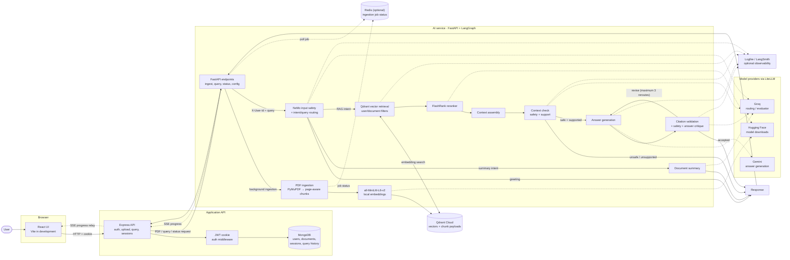

# Ask My Docs

Ask My Docs is a full-stack document question-answering application. Users can
register, upload PDFs, organize conversations into chat sessions, and ask
questions against all their documents or a selected document. Answers include
source-page citations and retrieved passages.

The application has three development processes:

1. **React + Vite** frontend (`frontend/`)
2. **Node.js + Express** API, authentication, and persistence (`backend/`)
3. **FastAPI + LangGraph** document ingestion and RAG service (`ai-research/`)

MongoDB stores application users, documents, sessions, and query history.
Qdrant Cloud stores document embeddings and chunk metadata. Redis is optional
and is used for asynchronous ingestion job status.

## Contents

- [Features](#features)
- [Architecture](#architecture)
- [RAG pipeline](#rag-pipeline)
- [Technology](#technology)
- [Evaluation results](#evaluation-results)
- [Project layout](#project-layout)
- [Requirements and configuration](#requirements-and-configuration)
- [Install and run locally](#install-and-run-locally)
- [API overview](#api-overview)
- [Evaluation harness](#evaluation-harness)
- [Deployment notes](#deployment-notes)

## Features

- Account registration, login, and logout using an HTTP-only JWT cookie.
- PDF upload (maximum 20 MB), background ingestion, status polling, retry of
  failed uploads, and deletion.
- Document selection to scope questions, or ask across all of the user's
  documents.
- Persistent chat sessions, session titles, and saved query/answer history.
- Live query progress events via Server-Sent Events (SSE).
- RAG responses with citations referencing the PDF name and page number.
- A retrieval, context-safety, and answer-quality loop that avoids generating
  from missing, irrelevant, or unsafe context.
- Local text embeddings and reranking; hosted Groq and Gemini models for
  routing, evaluation, and generation.
- Optional Logfire instrumentation and LangSmith tracing.
- A golden-question evaluation harness with retrieval, citation, latency, and
  LLM-judge answer-quality metrics.

## Architecture

The diagram below follows the current implementation. Retrieval is **dense
vector search in Qdrant followed by FlashRank reranking**; the current runtime
does not use the older Chroma/BM25 hybrid-search design described in earlier
documentation.


```mermaid
flowchart LR
    user([User])

    subgraph client["Browser"]
        ui["React UI<br/>Vite in development"]
    end

    subgraph app["Application API"]
        api["Express API<br/>auth, upload, query, sessions"]
        auth["JWT cookie<br/>auth middleware"]
        mongo[("MongoDB<br/>users, documents,<br/>sessions, query history")]
    end

    subgraph ai["AI service · FastAPI + LangGraph"]
        fastapi["FastAPI endpoints<br/>ingest, query, status, config"]
        ingest["PDF ingestion<br/>PyMuPDF → page-aware chunks"]
        embed["all-MiniLM-L6-v2<br/>local embeddings"]
        triage["NeMo input safety<br/>+ intent/query routing"]
        retrieve["Qdrant vector retrieval<br/>user/document filters"]
        rerank["FlashRank reranker"]
        assemble["Context assembly"]
        check["Context check<br/>safety + support"]
        generate["Answer generation"]
        evaluate["Citation validation<br/>+ safety + answer critique"]
        summary["Document summary"]
    end

    qdrant[("Qdrant Cloud<br/>vectors + chunk payloads")]
    redis[("Redis (optional)<br/>ingestion job status")]

    subgraph models["Model providers via LiteLLM"]
        groq["Groq<br/>routing / evaluator"]
        gemini["Gemini<br/>answer generation"]
        hf["Hugging Face<br/>model downloads"]
    end

    obs["Logfire / LangSmith<br/>optional observability"]

    user --> ui
    ui -->|"HTTP + cookie"| api
    api --> auth
    auth --> mongo
    api -->|"PDF / query / status request"| fastapi
    fastapi -->|"background ingestion"| ingest
    fastapi -->|"X-User-Id + query"| triage
    fastapi -.->|"SSE progress"| api
    api -.->|"SSE progress relay"| ui

    ingest --> embed
    embed --> qdrant
    ingest -.->|"job status"| redis
    fastapi -.->|"poll job"| redis

    triage -->|"greeting"| answer["Response"]
    triage -->|"summary intent"| summary
    summary --> answer
    triage -->|"RAG intent"| retrieve
    retrieve <-->|"embedding search"| qdrant
    retrieve --> rerank --> assemble --> check
    check -->|"unsafe / unsupported"| answer
    check -->|"safe + supported"| generate
    generate --> evaluate
    evaluate -->|"accepted"| answer
    evaluate -->|"revise (maximum 3 reroutes)"| generate
    answer --> fastapi
    fastapi --> api

    triage -.-> groq
    check -.-> groq
    evaluate -.-> groq
    summary -.-> groq
    generate -.-> gemini
    embed -.-> hf
    rerank -.-> hf
    triage -.-> obs
    retrieve -.-> obs
    check -.-> obs
    generate -.-> obs
    evaluate -.-> obs
```

### Request and data flow

1. The browser calls the Express API. Login establishes an HTTP-only JWT cookie;
   protected routes use that cookie to identify the user.
2. On upload, Express checks for a PDF (up to 20 MB), hashes it for duplicate
   detection, saves a MongoDB document record, and forwards the PDF to FastAPI
   in the background.
3. FastAPI extracts and normalizes PDF page text, splits it into overlapping
   structure-aware chunks, embeds the chunks with `all-MiniLM-L6-v2`, and
   upserts vectors plus ownership/page metadata to Qdrant.
4. The UI polls the document status. Redis backs job-status tracking when
   available; the AI service can fall back to in-memory tracking.
5. For a question, Express forwards the query and authenticated user ID to
   FastAPI. The RAG pipeline filters Qdrant results by `user_id`, and by
   `document_id` when a document is selected.
6. FastAPI returns the answer, latency, and retrieved chunks. Express persists
   the query and answer in MongoDB and returns the response to the browser.
7. In parallel with the query request, the UI can subscribe to the query's SSE
   progress endpoint. Express relays events from FastAPI.

## RAG pipeline

The current LangGraph flow is:

1. **Triage and input safety** — NeMo Guardrails checks every input first. A
   lightweight Groq model then classifies greeting, RAG, or summary intent and
   rewrites document questions into search terms. Out-of-domain classification
   is telemetry; retrieval and the context check decide whether there is
   support in the user's documents.
2. **Retrieval** — the local embedding model vectorizes the search query.
   Qdrant returns up to `TOP_K_RETRIEVAL` chunks, scoped to the user and
   optionally to one document. No chunks means the graph returns a
   no-information answer without generation.
3. **Reranking** — FlashRank scores the candidates and keeps up to
   `TOP_K_RERANK` passages above the request's score threshold.
4. **Context assembly and context check** — the selected passages are formatted
   and an evaluator model checks whether the context is both safe from
   prompt-injection instructions and relevant enough to support the question.
   Unsafe or unsupported context stops before answer generation.
5. **Generation and output evaluation** — Gemini drafts a cited response. The
   evaluator checks citation presence and that cited document pages occur in
   the retrieved context, then evaluates safety and whether the answer addresses
   the question. A failed answer is sent back to generation with feedback for
   up to three reroutes.
6. **Summary path** — summary requests use the graph's summary node rather than
   the normal retrieval-and-answer route. Greetings return a short response
   without retrieval.

NeMo input safety is embedding-based and does not add an LLM call. If a safety
check service fails, `GUARDRAIL_FAIL_MODE=closed` (the default) fails closed;
`open` allows the graph to proceed when the safety service is unavailable.
Genuine safety blocks are not overridden by `open`.

### Model routing

LiteLLM uses the model aliases configured in
[`ai-research/llm_gateway/litellm_config.yaml`](./ai-research/llm_gateway/litellm_config.yaml):

| Alias | Main model | Main use |
|---|---|---|
| `cheap-model` | Groq `openai/gpt-oss-20b` | Intent routing and query rewrite |
| `evaluator-model` | Groq `openai/gpt-oss-120b` | Context check and output evaluation |
| `strong-model` | Gemini `gemini-3.6-flash` | Final answer generation |

Fallback aliases are configured for each role: Gemini Flash-Lite for routing,
Groq `gpt-oss-120b` for generation, and Gemini Flash for evaluation. Summary
generation uses the model aliases defined by the corresponding graph nodes.

## Technology

| Area | Components |
|---|---|
| Frontend | React 18, Vite, React Router, React Markdown, remark-math, KaTeX |
| Application/API | Node.js, Express 5, Axios, Multer, cookie-parser, CORS |
| Authentication | JSON Web Tokens in HTTP-only cookies; bcryptjs password hashing |
| Application persistence | MongoDB with Mongoose |
| AI API and orchestration | Python, FastAPI, Uvicorn, LangGraph, Pydantic Settings |
| PDF ingestion | PyMuPDF (`pymupdf`), LangChain text splitters |
| Embeddings | Sentence Transformers `all-MiniLM-L6-v2` |
| Vector store | Qdrant Cloud with cosine similarity and ownership payload filters |
| Reranking | FlashRank `ms-marco-MiniLM-L-12-v2` |
| Model access | LiteLLM Router, Groq, Gemini |
| Input/output safety | NeMo Guardrails and evaluator-node checks |
| Optional job status | Redis |
| Observability | Logfire and LangSmith |
| Evaluation | Custom retrieval/citation/latency scorer and Groq LLM judge |

## Evaluation results

The following values are from
[`evaluation/runs/19Sept/overall_metrics.json`](./evaluation/runs/19Sept/overall_metrics.json).
The raw run contained 66 records; errored question `q034` was excluded, leaving
65 evaluated questions. The values describe this saved run and dataset, not a
guarantee for future documents or queries.

### Retrieval

| Metric | Result | Meaning |
|---|---:|---|
| Mean chunks retrieved (all questions) | 3.5692 | Average result count, including empty retrievals |
| Mean chunks retrieved (non-empty only) | 3.8033 | Average result count when at least one chunk was returned |
| Empty retrievals | 4 / 65 (6.15%) | Questions with no retrieved chunks |
| Retrieved-count distribution | 0: 4 · 1: 7 · 2: 8 · 3: 9 · 4: 3 · 5: 34 | Number of questions at each result count |
| Hit Rate@K | 78.46% | At least one exact gold chunk ID was retrieved |
| Context Recall@K | 77.69% | Fraction of expected gold chunk IDs retrieved, averaged by question |
| Context Precision@K | 26.74% | Fraction of returned chunks matching gold chunk IDs, averaged by question; empty retrieval scores 0 |
| Context Precision@K (non-empty only) | 28.50% | Precision averaged after excluding empty retrievals |
| MRR@K | 0.6587 | Mean reciprocal rank of the first exact gold chunk |

### Citations and answer quality

| Metric | Result | Meaning |
|---|---:|---|
| Citation presence | 92.31% (60 / 65) | Questions whose answer included a parseable PDF/page citation |
| Macro citation precision | 73.17% | Per-question precision of cited document/page pairs, macro-averaged over answers with citations |
| Citation recall | 75.38% | Gold pages covered by citations, averaged by question |
| Citation recall among cited answers | 81.67% | Citation recall for answers that included citations |
| Faithfulness (LLM judge) | 0.9385 / 1 | How well answer claims are supported by retrieved context |
| Correctness (LLM judge) | 0.7538 / 1 | Agreement with the golden reference answer |
| Answer relevancy (LLM judge) | 0.9077 / 1 | Whether the answer addresses the question |

The LLM judge scores each of faithfulness, correctness, and answer relevancy at
`0`, `0.5`, or `1`, then the report records their means. Its criteria are
documented in [`evaluation/judge.py`](./evaluation/judge.py).

### Latency

| Statistic | Seconds |
|---|---:|
| Mean | 33.7845 |
| P50 (median) | 29.35 |
| P95 | 57.0460 |
| P99 | 62.5084 |
| Minimum | 19.13 |
| Maximum | 67.59 |

### Diagnostics and strict citation parsing

| Diagnostic | Result |
|---|---:|
| Exact chunk Hit@1 | 56.92% |
| Exact chunk Hit@3 | 73.85% |
| Exact chunk Hit@5 | 78.46% |
| Lenient document/page overlap hit | 86.15% |
| Fraction of citations outside retrieved pages | 0.00% |

The lenient page diagnostic can count an answer as a hit when a retrieved chunk
overlaps a gold page, even if its exact chunk ID is not a gold ID. The
ungrounded-citation diagnostic checks whether cited pages appear in any
retrieved chunk.

The report also includes a stricter citation parse that accepts ASCII brackets
only (it does not normalize full-width `【】` brackets):

| Strict ASCII-bracket-only metric | Result |
|---|---:|
| Citation presence | 67.69% (44 / 65) |
| Macro citation precision | 78.94% |
| Citation recall | 59.23% |

The difference between regular and strict presence indicates that typographic
brackets emitted in some answers affected citation detection in this evaluation
script.

Metric definitions and report generation are in
[`evaluation/evaluate.py`](./evaluation/evaluate.py). Retrieval metrics use
exact gold chunk IDs; citations are compared by PDF name and page.

## Project layout

```text
Ask-My-Docs/
├── frontend/
│   ├── src/
│   │   ├── App.jsx                 # Routes and client-side auth state
│   │   ├── components/             # Chat, sidebar, error boundary
│   │   ├── lib/api.js              # Credentialed JSON API helper
│   │   └── pages/                  # Login, registration, dashboard
│   ├── index.html
│   ├── package.json
│   └── vite.config.js              # Dev server on 5173; API proxy to 5000
├── backend/
│   ├── server.js                   # Express app, middleware, Mongo connection
│   ├── src/
│   │   ├── controllers/            # Auth, document, query, session handlers
│   │   ├── lib/aiClient.js         # Authenticated FastAPI client
│   │   ├── middleware/             # JWT-cookie authentication
│   │   ├── models/                 # User, document, session, query records
│   │   └── routes/                 # Auth, documents, query, sessions, users
│   └── package.json
├── ai-research/
│   ├── config.py                   # Pydantic Settings and root .env loading
│   ├── main.py                     # FastAPI API and lifespan
│   ├── graph/                      # LangGraph state and graph wiring
│   ├── nodes/                      # Triage, retrieval, checks, generation, eval
│   ├── ingestion/                  # PDF parser, chunker, embedder, indexer
│   ├── retrieval/                  # Qdrant client, vector retrieval, reranker
│   ├── generation/                 # Summary/answer generation logic
│   ├── guardrails/                 # NeMo input and output policies
│   ├── llm_gateway/                # LiteLLM router and model configuration
│   ├── observability.py            # Logfire and LangSmith setup
│   └── README.md                   # Detailed AI API contract
├── evaluation/
│   ├── golden_dataset.json         # Golden question/reference dataset
│   ├── run_pipeline.py             # Calls the live API and checkpoints batches
│   ├── evaluate.py                 # Retrieval/citation/latency metrics
│   ├── judge.py                    # LLM answer-quality scoring
│   ├── auth.py / config.py         # Evaluation login and run settings
│   ├── golden/                     # Dataset export tooling and Qdrant fixture
│   └── runs/19Sept/                # Saved raw results and overall metrics
├── requirements.txt                # Python dependencies for AI/evaluation
├── package.json                    # npm workspaces and root dev scripts
├── package-lock.json
├── .env.sample                     # Root environment template
└── README.md
```

## Requirements and configuration

### Prerequisites

- Node.js 20 recommended (the npm workspace includes React/Vite and Express).
- Python 3.10 or newer; Python 3.11 is a good choice for the AI dependencies.
- npm.
- MongoDB (local or hosted).
- Qdrant Cloud account and collection credentials.
- Groq and Gemini API keys.
- Redis is optional for asynchronous ingestion status.

### Environment variables

Create a root `.env` from `.env.sample` and fill in credentials. Do not commit
`.env` or place provider keys in source files.

| Variable | Required | Purpose |
|---|---|---|
| `MONGODB_URI` | Yes for backend | MongoDB connection string |
| `JWT_SECRET` | Yes for backend | Signs authentication tokens |
| `PORT` | No | Express port; defaults to `5000` |
| `NODE_ENV` | No | Backend runtime mode |
| `CORS_ORIGIN` | No | Comma-separated allowed browser origins |
| `GROQ_API_KEY` | Yes for AI service | Groq routing and evaluator model access |
| `GEMINI_API_KEY` | Yes for AI service | Gemini generation model access |
| `QDRANT_URL` | Yes for AI service | Qdrant Cloud URL |
| `QDRANT_API_KEY` | Yes for AI service | Qdrant Cloud API key |
| `QDRANT_COLLECTION_NAME` | No | Collection name; defaults to `master_docs` |
| `HF_TOKEN` | No | Optional Hugging Face model access token |
| `REDIS_URL` | No | Job-status store; defaults to `redis://localhost:6379` |
| `NEMO_GUARDRAILS_CONFIG_PATH` | No | Guardrails config directory; defaults to `guardrails` |
| `GUARDRAIL_FAIL_MODE` | No | `closed` by default; can be `open` on safety-service errors |
| `ENV` | No | AI service mode; `development` enables reload when launched through `main.py` |
| `TOP_K_RETRIEVAL` | No | Candidate count before reranking; default `15` |
| `TOP_K_RERANK` | No | Maximum chunks after reranking; default `5` |
| `CHUNK_SIZE` | No | Chunk target size in characters; default `1500` |
| `CHUNK_OVERLAP` | No | Chunk overlap in characters; default `200` |
| `ALLOWED_ORIGINS` | No | FastAPI CORS origins; defaults to `*` |
| `LOGFIRE_TOKEN` | No | Enables Logfire when set |
| `LANGSMITH_TRACING` | No | Enables LangSmith tracing when `true` |
| `LANGSMITH_API_KEY` | No | LangSmith key when tracing is enabled |
| `LANGSMITH_ENDPOINT` | No | LangSmith endpoint |
| `LANGSMITH_PROJECT` | No | LangSmith project label |
| `ADMIN_API_TOKEN` | No | Optional token protecting runtime config updates |

`GROQ_API_KEY`, `GEMINI_API_KEY`, `QDRANT_URL`, and `QDRANT_API_KEY` have no
Python defaults and are required for the AI service to initialize. The frontend
uses same-origin relative API paths in production and the Vite proxy in
development; `VITE_API_URL` is not required by its current API helper.

For a local MongoDB server, use `localhost` in `MONGODB_URI`. When connecting
from a container, `localhost` would refer to the container itself; use a
reachable host name or hosted MongoDB URI instead.

## Install and run locally

Run commands from the repository root unless the command explicitly changes
directory.

### 1. Create and activate a Python virtual environment

PowerShell:

```powershell
python -m venv .venv
.\.venv\Scripts\Activate.ps1
```

Command Prompt:

```cmd
python -m venv .venv
.venv\Scripts\activate.bat
```

macOS/Linux:

```bash
python3 -m venv .venv
source .venv/bin/activate
```

### 2. Install Node and Python dependencies

With the Python virtual environment active:

```bash
npm run setup
```

This runs `npm install` for the root npm workspaces and
`python -m pip install -r requirements.txt` for the AI/evaluation dependencies.
The root npm workspaces install frontend and backend Node dependencies together.

### 3. Configure `.env`

PowerShell:

```powershell
Copy-Item .env.sample .env
```

Command Prompt:

```cmd
copy .env.sample .env
```

Edit `.env` and set the required MongoDB, JWT, model-provider, and Qdrant
values. If using LangSmith, set its API key and enable tracing.

### 4. Start all three development services

From the repository root:

```bash
npm run dev:all
```

This starts Vite, Express, and `python main.py` in `ai-research/` concurrently.
Output is labeled per service. Press **Ctrl+C** to stop the group. The command
expects the active Python executable to be available as `python` on `PATH`.

Open the frontend at **http://localhost:5173**. Vite proxies API routes to
Express on port `5000`; Express calls FastAPI at `http://127.0.0.1:8000`.

### Run services separately

Use three terminals if you need to control/restart a service independently:

```bash
# Terminal 1: AI service
cd ai-research
python main.py
```

```bash
# Terminal 2: backend (run from repository root)
npm run backend
```

```bash
# Terminal 3: frontend (run from repository root)
npm run frontend
```

The root npm scripts are:

| Command | Purpose |
|---|---|
| `npm run setup` | Install npm workspaces and root `requirements.txt` |
| `npm run dev:all` | Start frontend, backend, and AI service together |
| `npm run frontend` | Start Vite development server |
| `npm run backend` | Start Express with nodemon |
| `npm run build --workspace frontend` | Build static frontend assets |

## API overview

### Browser-facing Express API

Protected endpoints use the JWT cookie set by login.

| Method | Path | Purpose |
|---|---|---|
| `POST` | `/auth/register` | Create an account |
| `POST` | `/auth/login` | Authenticate and set the cookie |
| `POST` | `/auth/logout` | Clear the authentication cookie |
| `GET` | `/health` | Backend health response |
| `POST` | `/documents/upload` | Upload a PDF (`file` form field, max 20 MB) |
| `GET` | `/documents` | List the signed-in user's documents |
| `GET` | `/documents/:id/status` | Get/poll ingestion status |
| `DELETE` | `/documents/:id` | Remove a document and its Qdrant vectors |
| `POST` | `/query` | Ask a question and persist its response |
| `GET` | `/query/events/:queryId` | Stream query progress (SSE) |
| `GET` | `/sessions` | List chat sessions |
| `POST` | `/sessions` | Create a chat session |
| `PATCH` | `/sessions/:id` | Rename a session |
| `DELETE` | `/sessions/:id` | Delete a session |
| `GET` | `/sessions/:id/messages` | Load saved messages for a session |
| `GET` | `/users` | List non-sensitive user fields |

Example query body sent by the frontend:

```json
{
  "query": "What does the document say about retries?",
  "documentId": "optional-document-id",
  "sessionId": "chat-session-id",
  "chatHistory": [],
  "queryId": "a-client-generated-uuid"
}
```

The response contains `data.answer`, `data.retrieved_chunks`,
`data.latency_seconds`, and a MongoDB `history_id`.

### AI service API

The FastAPI service is normally reached through Express. User-scoped endpoints
receive `X-User-Id` from the authenticated backend.

| Method | Path | Purpose |
|---|---|---|
| `GET` | `/health` | AI service health response |
| `POST` | `/ingest` | Accept PDF, document ID, and user ID for ingestion |
| `GET` | `/ingest/status/{job_id}` | Read background ingestion job status |
| `POST` | `/query` | Invoke the LangGraph question-answering pipeline |
| `GET` | `/query/events/{query_id}` | Stream pipeline progress (SSE) |
| `DELETE` | `/documents/{document_id}` | Delete a user's vectors for a document |
| `GET` | `/config` | Read runtime pipeline configuration |
| `PATCH` | `/config` | Update whitelisted runtime knobs |

The AI query body uses snake_case (`document_id`, `top_k`, `top_n`,
`chat_history`, `query_id`). The response includes the original query, answer,
latency, and retrieved chunks with page metadata, vector score, and rerank score.
Pipeline business outcomes such as greetings, refusals, and no-match answers
are returned as normal query responses; API errors use the
`{"error":{"code":...,"message":"..."}}` envelope.

The AI API, request shapes, ingestion statuses, and error details are also
documented in [`ai-research/README.md`](./ai-research/README.md).

## Evaluation harness

The evaluation code separates live pipeline execution, algorithmic metrics,
and answer-quality judgment:

- [`evaluation/golden_dataset.json`](./evaluation/golden_dataset.json) contains
  the golden questions, human reference answers, expected chunk IDs, source PDF,
  and page labels.
- [`evaluation/run_pipeline.py`](./evaluation/run_pipeline.py) authenticates
  through the Express API, sends the golden queries, and checkpoints batches
  under `evaluation/results/raw_parts/` so runs can resume.
- [`evaluation/evaluate.py`](./evaluation/evaluate.py) scores exact chunk
  retrieval, citations against gold document/page labels, and latency. It
  writes `overall_metrics.json` and `per_question_metrics.csv`.
- [`evaluation/judge.py`](./evaluation/judge.py) uses a Groq-compatible LLM
  judge to score faithfulness, correctness, and answer relevancy.
- [`evaluation/auth.py`](./evaluation/auth.py) and
  [`evaluation/config.py`](./evaluation/config.py) configure login, target
  document, pacing, model, and output paths.
- [`evaluation/golden/export_dataset.py`](./evaluation/golden/export_dataset.py)
  supports preparing/exporting evaluation data; `qdrant_dataset.json` is a
  Qdrant fixture when present.

The saved `19Sept` metrics are reported above. To run a new evaluation, the
backend and AI service must be running, the golden PDF must already be ingested
into Qdrant, and evaluation credentials/document selection must be configured
according to `evaluation/config.py`. Evaluation can incur provider API usage.

## Deployment notes

The current project tree includes the three application services and their
local development commands. MongoDB and Qdrant are external dependencies;
Redis may be run locally or omitted, with reduced job-status persistence.
Production deployment should provide persistent MongoDB and Qdrant services,
secrets through the deployment environment, and appropriate CORS origins.

There is no Dockerfile or Compose file in the current repository tree, so
container build/deploy commands are not included here. `npm run build
--workspace frontend` produces the static frontend bundle; in a deployed web
architecture, serve that bundle alongside the backend or from a static host,
while keeping API routing and cookie/CORS settings aligned with the public
origin.

## Security and operations notes

- Keep `.env`, provider keys, database credentials, and JWT secrets out of Git
  and out of image layers.
- Use a strong, unique `JWT_SECRET`; serve the application over HTTPS in
  production so secure authentication cookies can be used.
- Restrict `CORS_ORIGIN` and `ALLOWED_ORIGINS` to the frontend origin for
  production deployments.
- Do not expose Qdrant credentials to the browser. Express forwards a verified
  user ID, and Qdrant retrieval filters by user and optional document ID.
- The backend limits PDF uploads to 20 MB and stores upload bytes in memory
  while handing them to the AI service.
- `REDIS_URL` is optional, but its in-memory fallback does not preserve job
  status across AI service restarts.
